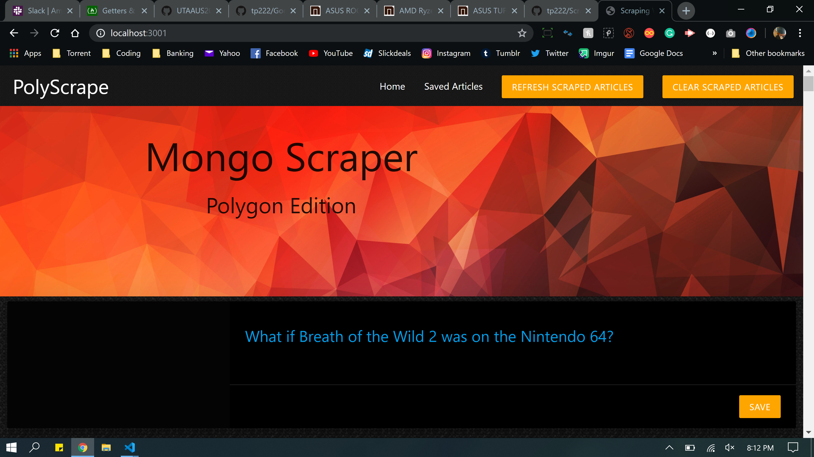

# Scraper
Homework 18 Mongo-Mongoose
 Scraping website

1. The problem my app is trying to solve:
    - My app is trying to provide the user with scraped articles from Polygon

2. How is this app organized:
    - The app utilizes mongoDb and Mongoose to store articles scraped and saved articles along with comments(did not complete)

3. How to run the app:
    - On load, the articles will render from the website.
    - Clear button will clear the scrapes
    - Refresh will reload the scraped articles

4. Images od the code working:
    - 
    - Rendering articles works. Clearing articles works. Refreshing articles works.
    - Was unable to save articles or commment on them.

    
